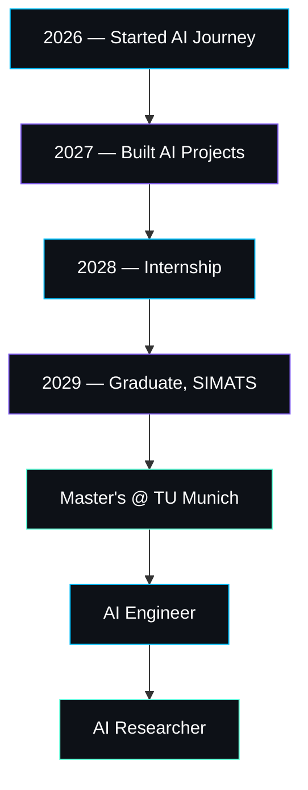

<div align="center">


<br/>

<a href="https://git.io/typing-svg">
  
</a>

<br/><br/>


</div>

<br/>


## 🧠 About Me

<table>
<tr>
<td width="60%">

```python
class AIEngineer:
    def __init__(self):
        self.name = "Doma Saketh"
        self.role = "AI & Machine Learning Engineer"
        self.current = "B.Tech AI & ML, SIMATS"
        self.grad_year = 2029
        self.location = "Chennai, India"
        self.dream_university = "Technical University of Munich"

    def mission(self):
        return "Build intelligent systems that solve real-world problems"

    def status(self):
        return "Learning. Building. Shipping. Repeat."

me = AIEngineer()
print(me.mission())
```

</td>
<td width="40%">

**Quick Facts**

🎓 B.Tech AI & ML — SIMATS, 2029
🇩🇪 Targeting M.S. at TU Munich
🛠️ Builder of real-world AI products
🏆 Mini Hackathon Winner
📜 Certified in Artificial Intelligence
🌱 Currently deep in ML & Deep Learning
🤝 Open to AI/ML collaborations

</td>
</tr>
</table>


## 🗨️ Thought of the Day

<div align="center">

</div>


## ⚙️ Tech Stack

<div align="center">

**Languages**


**Web & Frameworks**


**AI / ML / Cloud**


**Backend & Data**


**Tools**


</div>


## 📊 GitHub Analytics

<div align="center">


<br/>


<br/><br/>


</div>


## 🚀 Featured Projects

<table>
<tr>
<td width="33%" valign="top">

### 🛣️ RoadFix
**AI-powered pothole detection platform**

Crowdsources road-damage reports, geolocates them via Maps API, and uses AI to verify and prioritize repairs for city infrastructure teams.

`React` `TypeScript` `Firebase` `Firestore` `Google Maps API` `Cloud` `AI`

[](https://github.com/sakethdoma61-11)
[](https://github.com/sakethdoma61-11)

</td>
<td width="33%" valign="top">

### 🏨 Hostel Management System
**Full-stack hostel administration suite**

Digitizes room allocation, fee tracking, and complaint resolution for college hostels with a relational database backend.

`HTML` `CSS` `JavaScript` `PHP` `MySQL`

[](https://github.com/sakethdoma61-11)
[](https://github.com/sakethdoma61-11)

</td>
<td width="33%" valign="top">

### 🧪 Saketh AI Lab
**365-Day AI Learning Platform**

A self-built daily-practice system tracking a full year of hands-on AI experiments, notes, and mini-projects from fundamentals to deep learning.

`React` `Firebase` `Python`

[](https://github.com/sakethdoma61-11)
[](https://github.com/sakethdoma61-11)

</td>
</tr>
</table>


## 🏆 Achievements & Certifications

<div align="center">

| 🏅 Achievement | 📌 Details |
|:--|:--|
| **Mini Hackathon Winner** | Recognized for rapid prototyping under time pressure |
| **Master in Artificial Intelligence Certificate** | Comprehensive certification covering core AI principles |
| **Internship Completion Certificate** | Applied AI/ML skills in a real production environment |
| **Technical Course Certificates** | Multiple completed courses across the AI/ML stack |

</div>


## 🗺️ Career Timeline




## 📚 Learning Roadmap

<div align="center">

```
[■■■■■■■■■■] Git & GitHub
[■■■■■■■■■■] HTML / CSS / JavaScript
[■■■■■■■■□□] React
[■■■■■■□□□□] Machine Learning
[■■■■■□□□□□] Deep Learning
[■■■■□□□□□□] TensorFlow / PyTorch
[■■■■□□□□□□] Cloud Computing
[■■■□□□□□□□] Docker
```

</div>

**🎯 Career Goal** — Become an AI Engineer building intelligent systems that solve real-world problems, ultimately pursuing advanced AI research through a Master's at the **Technical University of Munich**.

**🌍 Open Source Interests** — AI tooling, ML developer experience, applied deep learning projects, and civic-tech platforms like RoadFix.

**🤝 Let's Collaborate On** — Machine learning pipelines, full-stack AI products, cloud-deployed ML systems, and hackathon teams.


## 📡 Connect With Me

<div align="center">

<a href="https://github.com/sakethdoma61-11"></a>
<a href="https://linkedin.com/in/sakethdoma61-11"></a>
<a href="mailto:sakethdoma61-11@example.com"></a>

<br/><br/>


</div>


<div align="center">
<sub>Designed and built by Doma Saketh — Chennai, India 🇮🇳 → Munich, Germany 🇩🇪</sub>
</div>
